# HomeStack 🏠

An intuitive web application designed for families to manage their finances, track expenses, and replace manual paper-based accounting.

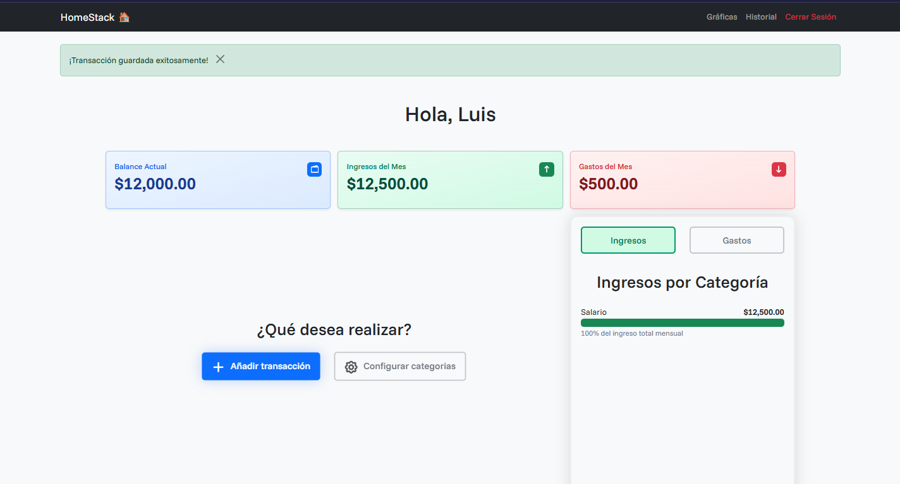
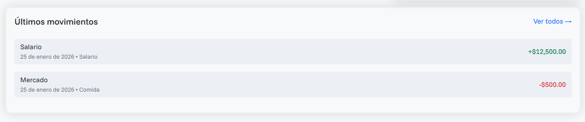

## Features
- **User Authentication:** Secure login, logout and registration using Flask-Login with data validations.

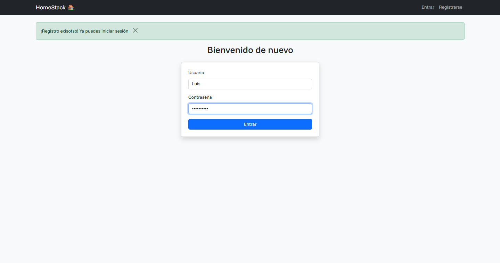
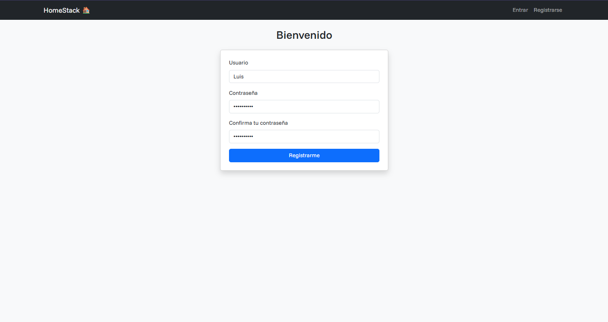

- **Complete Transaction Management:** Dynamic recording of income and expenses with persistence in the database.

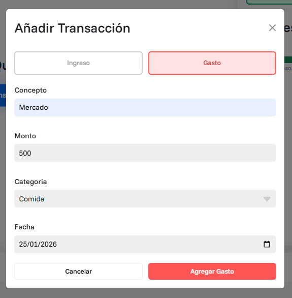

- **Categories System:**: Manage custom categories (add/delete) with real-time validations.

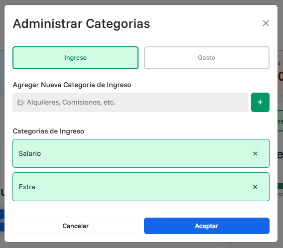

- **Transaction Tracking:** It stores all transactions in the database and displays them in the form of pages to avoid showing them all on one page, which would make the user experience bad. In addition to that, you can filter by income/expense or by category.

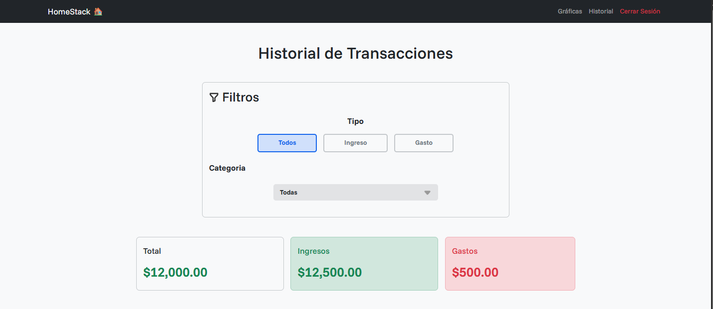
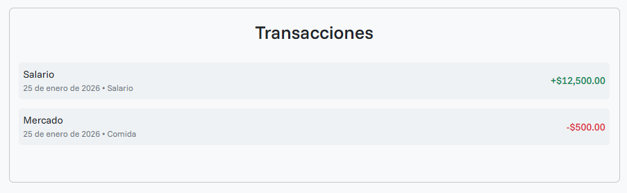

- **Visual Insights:** Dynamic reports of movements using the Chart.js library to display the charts of: evolution of income and expenses of the last six months, evolution of the balance in the last six months, and expenses per month of each category with the ability to filter by the month you want.

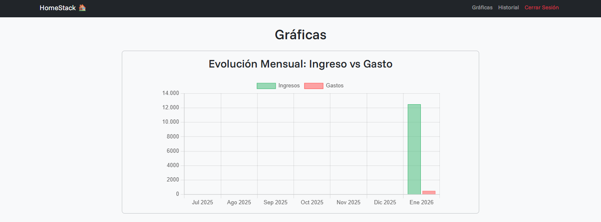
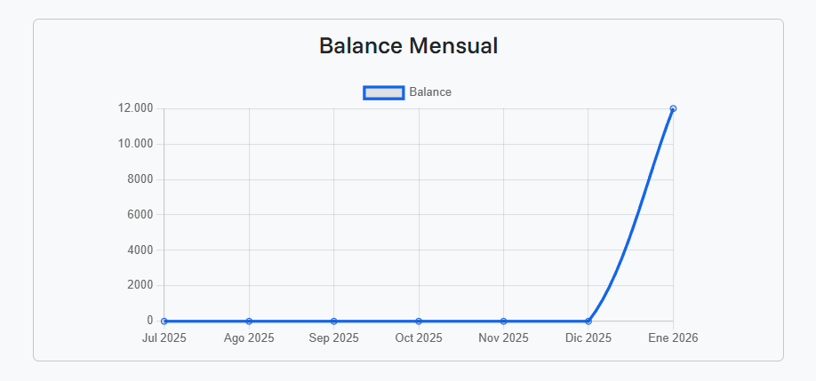
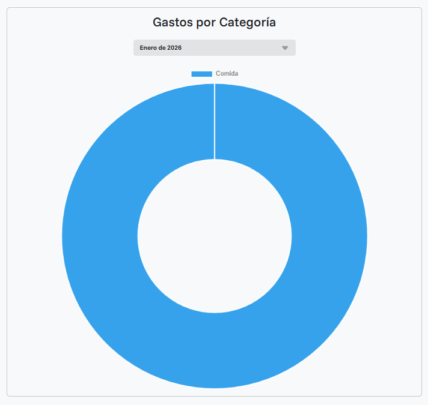

## Tech Stack
- **Backend:** Python / Flask (Flask, Flask-SQLAlchemy, Flask-Login, Flask-Migrate)

- **Frontend:** HTML / Bootstrap 5 / Vanilla JavaScript (UI validations and a custom select element)

- **Database:** SQLite / SQLAlchemy (Tables relationships and data persistance)

## What i learned

- **Modular Structure** I learned to decouple the application logic, not only for aesthetics, but also so that when a problem arises or something needs to be modified, you know where to look and don't have to sift through 1000+ lines of code for a simple `return` statement in a logic function. This is key for scalable projects. I went from a monolithic `app.py` file to a modular structure where each file and folder has its purpose and isn't a single file that handles everything on the page. This knowledge isn't just applicable to the application factory pattern, but to any project.

- **Components:** I learned to unify recurring structures in the code for use in the project, thereby eliminating unnecessary lines of code. In my project, this structure was the custom select element, which was repeated three times on the page, so I unified it into a single component.

- **Data Management:** I learned to manage data from a real database thanks to `SQLAlchemy`, which allows complete control over the database schema. Initially, I planned to use the CS50 library, which allows direct use of SQL code. However, I decided to take on the challenge of using an ORM for this project, and it was definitely the best option because it makes the code more readable and secure. `SQLAlchemy` is designed to automatically prevent SQL injection, and database management is automated. Furthermore, using `Flask-Migrate`, the database can evolve without losing user data.

_This project represents a significant milestone in my learning path, moving from volatile frontend storage (LocalStorage) to a persistent, secure, and structured relational database system._

## How to run
1. Clone the repository:
``` bash
git clone https://github.com/JesusHM0406/homestack
```

2. Access the project file:

``` bash
cd homestack
```

3. Create and activate a virtual environment

``` bash
python -m venv venv
.venv\Scripts\activate # Linux/macOS: source venv/bin/activate
```

4. Install requirements:

``` bash
pip install -r requirements.txt
```

3. Run the app: 
``` bash
flask run
```